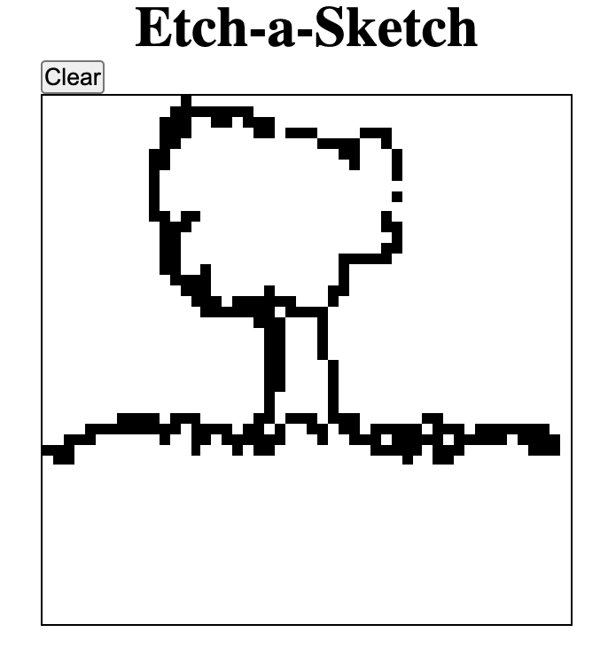

# The Odin Project - Etch-a-Sketch

This is a solution to the [Etch-a-Sketch challenge](https://www.theodinproject.com/paths/foundations/courses/foundations/lessons/etch-a-sketch-project) on [The Odin Project](https://www.theodinproject.com/).

## The challenge
- Add a button to the top of the screen which will clear the current grid and send the user a popup asking for the number of squares per side for the new grid. Once entered, the new grid should be generated in the same total space as before (e.g. 960px wide) so that you’ve got a new sketch pad.
- Set up a “hover” effect so that the grid divs change color when your mouse passes over them, leaving a (pixelated) trail through your grid like a pen would.
- Create a webpage with a 16x16 grid of square divs.

### Screenshot

### Links

- [Solution](https://github.com/LandonRGeorge/odin-etch-a-sketch)
- [Live Site](https://landonrgeorge.github.io/odin-etch-a-sketch/)

### Built with

- HTML
- CSS (including Grid)
- JavaScript
